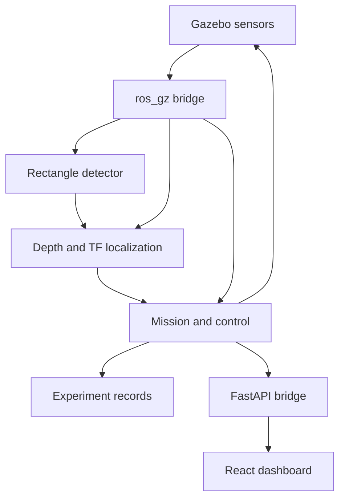

# Architecture

The pure `aperturenav` package owns geometry, configuration, PID, mission logic,
perception and world generation. `Simulation` supplies a deterministic local
kinematic execution harness. ROS adapters reuse the same algorithms.

ROS perception and localization run in separate processes. Mission sequencing,
PID, clearance, collision checking, visualization and logging currently run in
one navigator process. Splitting those into additional processes is a future
refactoring, not represented by empty package stubs.

Local mode: FastAPI advances the kinematic simulation on its event loop. ROS
mode: a ROS executor thread receives telemetry and forwards operator commands.
REST state mutations use the same event loop as local stepping. WebSocket
telemetry is sent at 10 Hz. The API binds to loopback by default; no login or
multi-user coordination is implemented.

World and ROS transforms use x forward, y left and z up. Aperture yaw rotates
its normal in the world XY plane. Optical camera coordinates use x right,
y down and z forward. All navigation distances are metres and angles radians.
