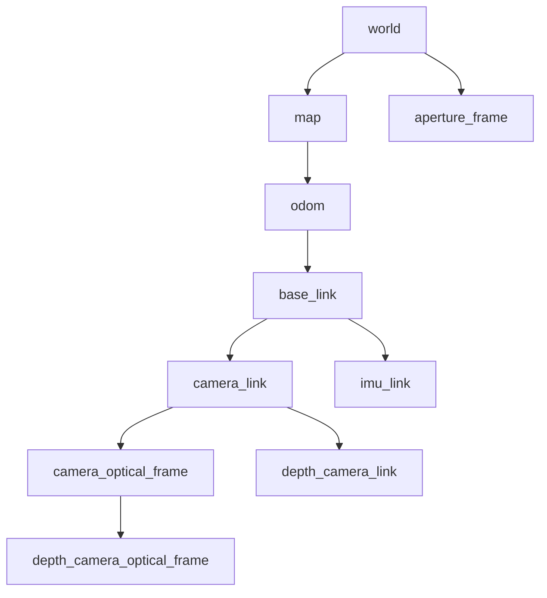

# Coordinate frames

`world → map → odom` are identity static transforms. Odometry updates
`odom → base_link`; robot_state_publisher publishes the fixed camera/IMU/rotor
transforms. Localization publishes `world → aperture_frame` at the image stamp.
RGB and depth share an optical center in this baseline. No LiDAR link is
advertised because LiDAR is not included.
